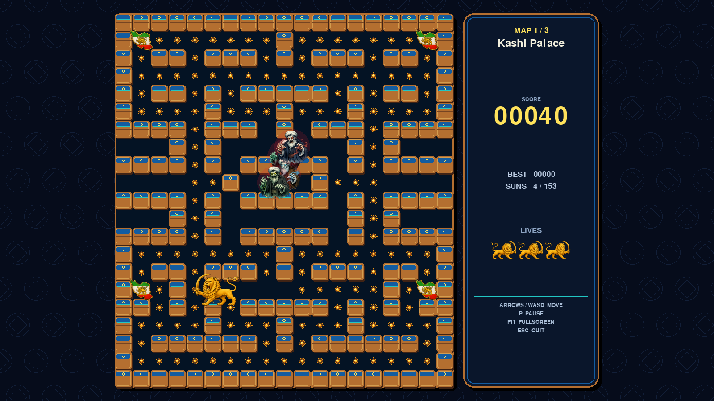
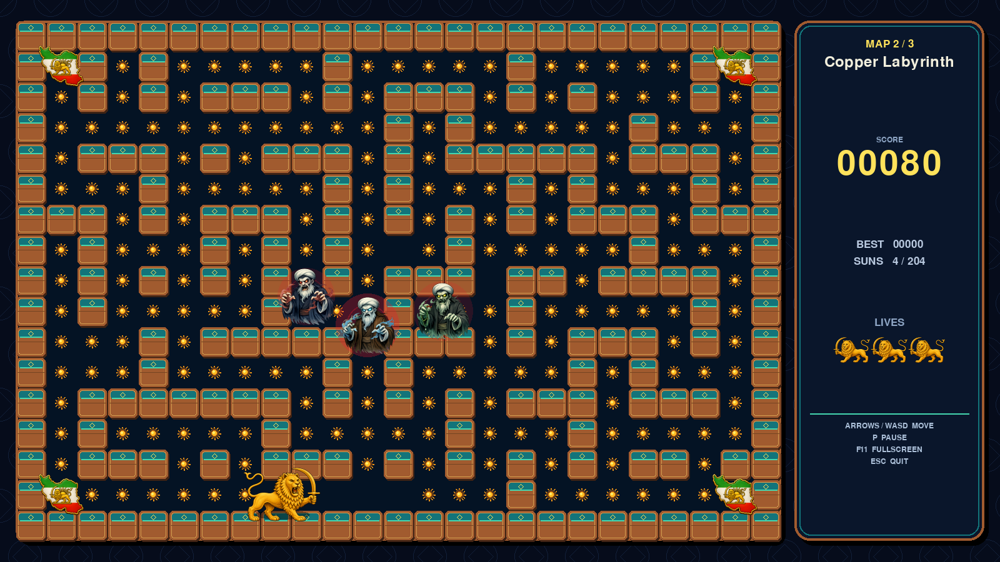
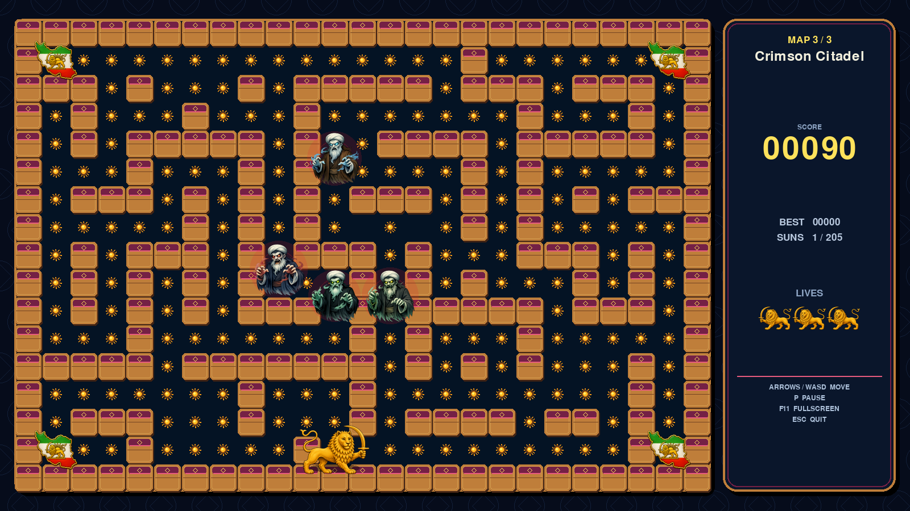

# Lion & Sun Maze

یک بازی آرکید دوبعدی و تمام‌صفحه، الهام‌گرفته از ساختار کلاسیک Pac-Man. قهرمان بازی شیر طلاییِ شمشیر‌به‌دست است، نشان‌های کوچک خورشیدند و قدرت‌افزاها نقشهٔ ایران با نشان شیر و خورشید هستند.







## امکانات

- سه نقشهٔ مستقل با ابعاد و طراحی متفاوت و سه تم کاشی‌کاری
- اجرای پیش‌فرض تمام‌صفحه و مقیاس خودکار برای رزولوشن مانیتور
- شیر طلایی بزرگ با دو فریم هماهنگ دهان باز و بسته
- خورشیدهای درخشان و چهار قدرت‌افزای نقشهٔ ایران در هر مرحله
- چهار دشمن ترسناک با هالهٔ متحرک قرمز و ظاهر متفاوت
- جهت صحیح بدن، سر و شمشیر شیر در حرکت چپ و راست
- بیداری دائمی حالت شیر و خورشید پس از تمام‌شدن سه جان؛ از این لحظه شکست ممکن نیست
- خورشید چرخان، پرتوها، ذرات طلایی و حاشیهٔ نورانی در حالت شکست‌ناپذیر
- کارت پیروزی اختصاصی با پیام `PAHLAVI IS PROUD OF YOU`
- چهار دشمن با رنگ و رفتار متفاوت:
  - **Chaser:** مستقیماً بازیکن را دنبال می‌کند.
  - **Ambusher:** چند خانه جلوتر از مسیر بازیکن را هدف می‌گیرد.
  - **Wanderer:** در تقاطع‌ها به‌صورت تصادفی انتخاب مسیر می‌کند.
  - **Shy:** از دور تعقیب می‌کند و در فاصلهٔ نزدیک به گوشهٔ خود برمی‌گردد.
- سه جان، امتیاز، رکورد، زنجیرهٔ امتیاز خوردن دشمنان و حالت توقف
- صفحه‌های شروع، پیروزی و پایان بازی

## نصب و اجرا

Python 3.10 یا جدیدتر پیشنهاد می‌شود.

در ویندوز می‌توانید روی `run_game.bat` دوبار کلیک کنید. این فایل در اجرای اول محیط محلی و Pygame را به‌طور خودکار آماده می‌کند. روش دستی:

```powershell
python -m pip install -r requirements.txt
python lion_sun_maze.py
```

## کنترل‌ها

| کلید | عملکرد |
|---|---|
| کلیدهای جهت‌نما یا `WASD` | حرکت |
| `Enter` یا `Space` | شروع / شروع دوباره |
| `P` | توقف و ادامه |
| `F11` | جابه‌جایی میان تمام‌صفحه و پنجره |
| `Esc` یا `Q` | خروج |

## بررسی سریع پروژه

برای بررسی ساختار ماز و دسترسی‌پذیر بودن تمام خورشیدها:

```powershell
python lion_sun_maze.py --self-test
```

برای شروع مستقیم در حالت پنجره‌ای می‌توانید از `python lion_sun_maze.py --windowed` استفاده کنید.

## شخصی‌سازی

تنظیمات اصلی ابتدای فایل `lion_sun_maze.py` قرار دارند. نقشه‌ها در آرایهٔ `LEVELS` تعریف شده‌اند. نشانه‌ها عبارت‌اند از: `#` دیوار، `.` خورشید، `o` قدرت‌افزای نقشهٔ ایران، `P` محل شروع بازیکن، اعداد `1` تا `4` محل شروع دشمنان و `=` دروازهٔ خانهٔ دشمنان. تصاویر قابل تعویض بازی در پوشهٔ `assets` هستند.

این پروژه یک اثر هجویه‌ای است و شخصیت‌ها کاملاً خیالی و کارتونی هستند.

## منطق جان سوم

پس از ازدست‌رفتن جان سوم، بازی به صفحهٔ باخت نمی‌رود. شیر با ۱۰۰۰ امتیاز اضافه در حالت دائمی `IMMORTAL` بیدار می‌شود. از آن لحظه برخورد با هر دشمن باعث حذف موقت دشمن و دریافت امتیاز می‌شود و این قدرت تا پایان نقشهٔ سوم باقی می‌ماند.

هنگام بیداری این پیام روی صفحه ظاهر می‌شود:

> هرگز شیر و خورشید بر ملا ها شکست نخواهد خورد

اگر فایل بازی مستقیماً با Python عمومی ویندوز اجرا شود، برنامه به‌طور خودکار محیط `.venv` پروژه را پیدا می‌کند؛ بنابراین خطای نبودن Pygame رخ نخواهد داد. اگر محیط محلی هنوز ساخته نشده باشد، یک بار `run_game.bat` را اجرا کنید.
